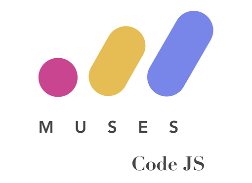

# Coding Dojo Melbourne

  

  
  

### Tech Requirements
1. Ensure that you have node installed in your system
  ##### For Windows Users
  - [Download the Windows installer](https://nodejs.org/en/download/) from the Nodes.js® web site.
  - Run the installer.
  - Follow the prompts in the installer (Accept the license agreement, click the NEXT button and accept the default installation settings).
  ##### For Mac Users
  - use homebrew/nvm to install node (instructions on how to install homebrew and node are [here](https://treehouse.github.io/installation-guides/mac/node-mac.html))
2. You have to know the basic of JavaScript.
  - dofactory: JavaScript reference guide http://www.dofactory.com/tutorial/javascript
  - JavaScript reference: https://developer.mozilla.org/en-US/docs/Web/JavaScript/Reference

  If you do need a blueprint of learning JavaScript, This article may provide you a short guide.
  https://medium.freecodecamp.org/a-beginners-javascript-study-plan-27f1d698ea5e

  Do you want to learn by doing?
  Here is a free source for you.
  https://www.codecademy.com/

  If you want to practice JavaScript(or along with HTML5/CSS3) briefly without heavy setup, JSFiddle provides a decent place for you.
  https://jsfiddle.net/

  and you can find many more sources from global web!

### Running the Katas

1. fork the github repository
2. change directories into the katas folder `cd katas`
3. change directories into one of the katas - e.g. `cd fizz-buzz`
4. run `nvm use` to run with the latest node version.
5. run `npm install` to use the dependencies (at present its mocha to write the tests)
6. run `npm test` to run the tests.

Share your work by following the [Contributing Guidelines](./CONTRIBUTING.md)

### Feedback

For any other feedbacks feel free to email us at `melbourne@musescodejs.org`
